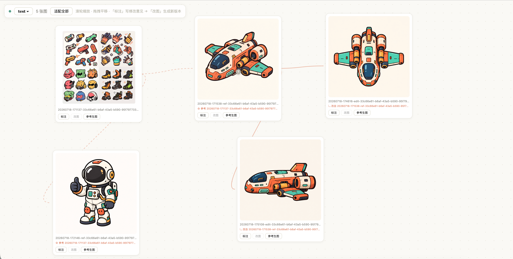

# ChatGPT Endless Canvas

> ### 🆓 Burns zero Codex / API quota
> An infinite-canvas image board that generates through the **ChatGPT web app**
> you already pay for — no API key, no per-image billing, and none of your
> Codex quota.

**[中文文档 →](README.zh-CN.md)**

An infinite-canvas image board powered by the **ChatGPT web app** — no paid API.
It drives your own logged-in chatgpt.com session over Chrome DevTools Protocol
(CDP) to generate images, and streams every result onto a local pan/zoom canvas
with Lovart-style iteration tools:



- 🎨 **Infinite canvas** — pan, zoom, drag cards, layouts persist per board
- ✏️ **Annotate → Regenerate** — draw a box/point on an image, write a revision
  note, hit regenerate; the server re-prompts ChatGPT with the original attached
  as reference
- ⭐ **Style-reference generation** — use any image on the board as a style
  anchor and generate new subjects in the same look
- 📋 **Scheduled batches** — submit a prompt list; jobs run serially with a
  random 30–120 s pause between them (human-ish pacing, avoids rate limiting)
- 🌳 **Lineage tracking** — every generated image records its parent and the
  notes that produced it; the canvas draws the family tree (solid = edit,
  dashed = style reference)
- 🗂 **Multiple boards** — each board is a plain, portable directory (images +
  `layout.json` + `annotations.json` + `lineage.json`)
- 📥 **Drag & drop** — drop local images onto the canvas to bring them into the
  workflow
- 🌐 **Trilingual UI** — switch the board between 中文 / English / 日本語 right
  from the toolbar (remembered per browser)
- 🤖 **Claude Code skill included** — let Claude submit prompts, batches, and
  edits to the board for you

The board server is **stdlib-only Python**; the generator needs just
`pip install playwright` (no browser download — it attaches to your Chrome).

## How it works

```
board.html  ──►  board_server.py  ──►  generate_chatgpt_image.py  ──►  Chrome (CDP :9222)
 (canvas)         (queue, boards,        (send prompt + reference,        └─ your logged-in
                   lineage, uploads)      wait, download final PNG)          chatgpt.com session
```

No API keys, no cookies to copy: you log into chatgpt.com once in a dedicated
Chrome profile; the tool reuses that session. Generated images render in the
assistant reply as progressive frames — the script waits until the stored-file
URL settles (and excludes any image that existed before the prompt, so stale
results from earlier chats can never be grabbed).

## Quick start

```bash
git clone https://github.com/<you>/chatgpt-endless-canvas.git
cd chatgpt-endless-canvas

# 1. one-time: install playwright into a venv (no `playwright install` needed)
python3 -m venv .venv && .venv/bin/pip install -r requirements.txt

# 2. launch the debug Chrome, log into chatgpt.com in it, keep it open
bash launch-chrome-debug.sh

# 3. start the board (idempotent; survives the terminal via nohup)
bash start.sh                      # → http://127.0.0.1:8090
```

Data lives in `~/Documents/chatgpt-endless-image-gen/` — `boards.json` is the
board registry; each board directory is self-contained and portable.

## CLI generation (no board)

```bash
.venv/bin/python generate_chatgpt_image.py \
  --prompt "a cozy cabin in snow, watercolor" \
  --output out.png \
  [--reference style.png] [--timeout 240] [--grab-only]
```

`--grab-only` re-grabs the newest image already on the ChatGPT page — useful
when generation finished after the script timed out.

## HTTP API

| Endpoint | Description |
|---|---|
| `GET /api/state` | board, images, layout, annotations, lineage, jobs — one call |
| `POST /api/generate` | `{"prompt":"..."}` plain generation; add `"name":"<image>"` to use it as a style reference; `"prompts":[...]` schedules a batch (≤50, random interval) |
| `POST /api/regenerate` | `{"name":"<image>"}` — regenerate from its pending annotations |
| `POST /api/annotations` | write the full annotations object (normalized 0-1 coords) |
| `POST /api/upload?name=x.png` | raw image bytes → active board |
| `GET/POST /api/boards` | list / `{"action":"create","name":..,"dir":..}` / `{"action":"open","id":..}` |
| `POST /api/layout` | persist card positions (`?board=<id>` guards stale writes) |

## Claude Code skill

`skills/chatgpt-image/SKILL.md` teaches Claude Code to run the whole loop —
check Chrome, start the board, submit prompts/batches/edits via the API, and
report results. Install:

```bash
mkdir -p ~/.claude/skills
cp -r skills/chatgpt-image ~/.claude/skills/
```

If you cloned somewhere other than `~/Workspace/chatgpt-endless-canvas`,
set `CHATGPT_IMAGE_GEN_HOME=/path/to/clone` in your shell profile (the skill
falls back to the default path).

## Configuration

| Env | Default | Meaning |
|---|---|---|
| `BOARD_PORT` | `8090` | board server port |
| `IMAGE_GEN_DATA` | `~/Documents/chatgpt-endless-image-gen` | data root |
| `CHATGPT_CDP_URL` | `http://127.0.0.1:9222` | Chrome debug endpoint |
| `BATCH_INTERVAL` | `30-120` | random pause (s) between batch jobs |
| `BOARD_DIR` | — | single-board mode on exactly this directory |
| `DEBUG_PORT` / `PROFILE_DIR` / `CHROME_BIN` | — | launch-chrome-debug.sh knobs |

## Limitations & notes

- ChatGPT's web UI changes often; selectors in `generate_chatgpt_image.py` are
  defensive but may need updating after redesigns.
- "Edit" is a full re-generation guided by the reference image + zone-worded
  notes — not true in-place inpainting.
- Back-to-back generations can trip ChatGPT's silent rate limiting (prompt sent,
  no reply). The batch scheduler's random pauses exist for exactly this reason.
- **Use with your own account, for personal purposes, at your own risk.**
  Automating the ChatGPT web app may conflict with OpenAI's Terms of Use.

## License

[MIT](LICENSE)
